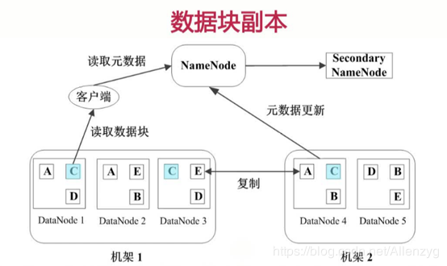
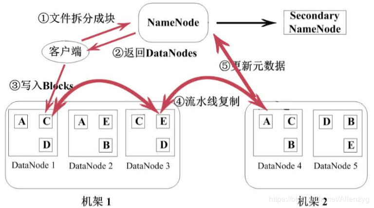
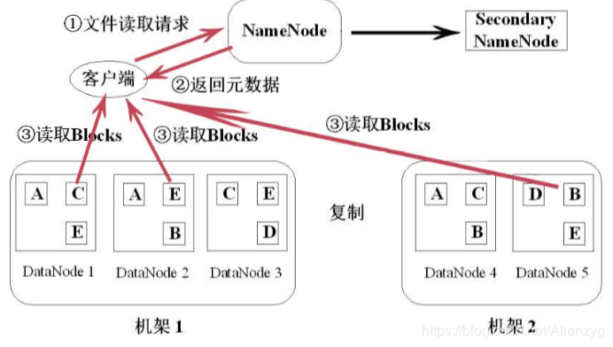

## **1. 大数据简介**

### **1.1 大数据的由来**

```
	随着计算机技术的发展，互联网的普及，信息的积累已经到了一个非常庞大的地步，信息的增长也在不断的加快，随着互联网、物联网建设的加快，信息更是爆炸式增长，收集、检索、统计这些信息越发困难，必须使用新的技术来解决这些问题
```

### **1.2 什么是大数据**

```
【1】定义
	大数据指无法在一定时间范围内用常规软件工具进行捕捉、管理和处理的数据集合，需要新处理模式才能具有更强的决策力、洞察发现力和流程优化能力的海量、高增长率和多样化的信息资产
	
【2】总结
	大数据是指即从各种各样类型的数据中，获得有价值的信息
```

### **1.3 大数据特性**

```
【1】大体量（Volume）
	数据体量大,一般从TB级别开始计算，可从数百TB到数十数百PB甚至EB的规模
	KB、MB、GB、TB、PB、EB、... ...
	1KB = 1024Bytes
	1MB = 1024K
	1GB = 1024M
	1TB = 1024G
	1PB = 1024T
	1EB = 1024P
	... ...
【2】多样性（Variety）
	数据的种类和来源多(爬虫、数据库、网络日志)
【3】时效性（Velocity）
	很多大数据需要在一定的时间限度下得到及时处理
【4】准确性（Veracity）
	处理的结果要保证一定的准确性
【5】大价值（Value）
	大数据包含很多深度的价值，大数据分析挖掘和利用将带来巨大的商业价值

【补充】
	数据的价值密度越来越低,但是这并不意味着想要的数据越来越少,相反我们想要的数据是越来越多，但是样本总量的增长速度是要高于想要的数据的增长速度的
```

### **1.4 带来的问题**

```
【1】数据存储问题 - 存储速度、存储空间
【2】数据计算|分析问题 - 性能与效率问题
```

### **1.5 大数据与Hadoop**

```
【1】Hadoop是什么？
    1.1) Hadoop是一种分析和处理海量数据的软件平台
    1.2) Hadoop是一款开源软件，使用JAVA开发
    1.3) Hadoop可以提供一个分布式基础架构
```

## **2. Hadoop简介**

###  **2.1 Hadoop概述**

#### **2.1.1 Hadoop概念**

- **定义**

  Hadoop是Yahoo!开发，后贡献给了Apache的一套开源的、可靠的、可扩展的用于分布式计算的框架

- **Hadoop作者** 

  Doug cutting

- **Hadoop名字由来** 

  以Hadoop作者的孩子的一个棕黄色的大象样子的玩具的命名

  


#### **2.1.2 Hadoop特点**

- **高可靠性** 

  Hadoop按位存储和数据处理的能力值得信赖

- **高扩展性**

  Hadoop通过可用的计算机集群分配数据，完成存储和计算任务，这些集群可以方便地扩展到数以千计的节点中，具有高扩展性

- **高效性**

  Hadoop能够在节点之间进行动态地移动数据，并保证各个节点的动态平衡，处理速度非常快，具有高效性

- **高容错性**

  Hadoop能够自动保存数据的多个副本（默认是3个），并且能够自动将失败的任务重新分配


#### **2.1.3 Hadoop能做什么**

- **大数据量存储**

  分布式存储（各种云盘，百度，360~还有云平台均有hadoop应用）

- **日志处理**

- **搜索引擎**

  如何存储持续增长的海量网页:  单节点 V.S. 分布式存储

  如何对持续增长的海量网页进行排序: 超算 V.S. 分布式计算

- **数据挖掘**

  目前比较流行的广告推荐

#### **2.1.4 Hadoop版本**

- **Hadoop1.0**

  包含Common，HDFS和MapReduce，停止更新

- **Hadoop2.0**

  包含了Common，HDFS（分布式存储），MapReduce（分布式计算）YARN。Hadoop2.0和Hadoop1.0完全不兼容。

- **Hadoop3.0**

  包含了Common，HDFS，MapReduce，YARN（资源管理。Hadoop3.0和Hadoop2.0是兼容的

### **2.2 Hadoop核心组件**

#### **2.2.1 HDFS（Hadoop Distributed File System）**

- **HDFS**

  分布式存储，解决海量数据的存储

- **HDFS特点及原理**

  HDFS具有扩展性、容错性、海量数量存储的特点

  原理为将大文件切分成指定大小的数据块, 并在分布式的多台机器上保存多个副本

- **HDFS角色和概念**

  1. Client

     切分文件、访问HDFS、与NameNode交互获取文件位置信息、与DataNode交互读取和写入数据

  2. Namenode

     Master节点，管理HDFS的名称空间和数据块映射信息，配置副本策略，处理所有客户端请求

  3. Secondarynode

     定期同步NameNode，紧急情况下，可转正

  4. Datanode

     数据存储节点，存储实际的数据

     汇报存储信息给NameNode

  5. Block

     每块默认128MB大小

     每块可以多个副本

- **HDFS示意图**

  

- **HDFS原理图**

  ==1、每个数据块3个副本，分布在两个机架内的节点，2个副本在同一个机架上，另外一个副本在另外的机架上==

  

  ==2、心跳检测，datanode定期向namenode发送心跳消息。查看是否有datanode挂掉了==

  ​								

  ==3、secondary namenode;定期同步元数据映像文件和修改日志，namenode发生故障，secondaryname会成为主namenode==

  ​					

  

- **HDFS写文件流程**

  ```
  【1】客户端将文件拆分成固定大小128M的块，并通知namenode
  【2】namenode找到可用的datanode返回给客户端
  【3】客户端根据返回的datanode，对块进行写入
  【4】通过流水线管道流水线复制
  【5】更新元数据，告诉namenode已经完成了创建新的数据块，保证namenode中的元数据都是最新的状态
  ```

  ​	

- **HDFS读文件流程**

  ```
  【1】客户端向namenode发起读请求，把文件名，路径告诉namenode
  【2】namenode查询元数据，并把数据返回客户端
  【3】此时客户端就明白文件包含哪些块，这些块在哪些datanode中可以找到
  ```

  ​	

#### **2.2.2 MapReduce**

- **MapReduce实现了分布式计算**

  Hadoop的MapReduce是对google三大论文的MapReduce的开源实现，实际上是一种编程模型，是一个分布式的计算框架，用于处理海量数据的运算，由JAVA实现

- **MapReduce原理图**

  

- **MapReduce角色及概念**

  1. JobTracker

     –Master节点只有一个

     –管理所有作业/任务的监控、错误处理等

     –将任务分解成一系列任务，并分派给TaskTracker

  2. TaskTracker

     –Slave节点，一般是多台

     –运行Map Task和Reduce Task

     –并与JobTracker交互，汇报任务状态

  3. Map Task

     –解析每条数据记录，传递给用户编写的map()并执行，将结果输出

  4. Reducer Task

     –从Map Task的执行结果中，远程读取输入数据，对数据进行排序，将数据按照分组传递给用户编写的reduce函数执行

#### 2.2.3 Yarn

- **作用**

  负责整个集群资源的管理和调度，是Hadoop的一个通用的资源管理系统

- **定义**

  Apache Hadoop YARN （Yet Another Resource Negotiator，另一种资源协调者）是一种新的 Hadoop 资源管理器，它是一个通用资源管理系统，可为上层应用提供统一的资源管理和调度，它的引入为集群在利用率、资源统一管理和数据共享等方面带来了巨大好处

- **原理图**

  

- **Yarn角色及概念**

  1. Resourcemanager
  
     –处理客户端请求 
  
     –启动/监控ApplicationMaster
  
     –监控NodeManager
  
     –资源分配与调度 
  
  2. Nodemanager
  
     –单个节点上的资源管理 
  
     –处理来自ResourceManager的命令 
  
     –处理来自ApplicationMaster的命令 
  
  3. ApplicationMaster
  
     –为应用程序申请资源，并分配给内部任务 
  
     –任务监控与容错 
  
  4. Container
  
     –对任务运⾏行环境的抽象，封装了CPU 、内存等
  
  5. Client
  
     –用户与Yarn交互的客户端程序 
  
     –提交应用程序、监控应用程序状态，杀死应用程序等 

### **2.3 Hadoop总结**

#### **2.3.1 Hadoop组成**

1. 分布式存储 - HDFS
2. 分布式计算 - MapReduce+Yarn

#### **2.3.2 HDFS特点**

- **HDFS优点**
  1. 高可靠性
  2. 高扩展性
  3. 高效性
  4. 高容错性
  5. 低成本 ：与一体机、商用数据仓库等相比，hadoop是开源的，项目的软件成本因此会大大降低

- **HDFS缺点**
  1. 不能做到低延迟，对于低延迟数据访问，不适合hadoop
  2. 不适合大量小文件存储，由于namenode将文件系统的元数据存储在内存中，因此该文件系统所能存储的文件总数受限于namenode的内存容量，根据经验，每个文件、目录和数据块的存储信息大约占150字节
  4. 对于上传到HDFS上的文件，不支持修改文件，HDFS适合一次写入，多次读取的场景

#### **2.3.3 HDFS相关**

- **名词**
  1. NameNode
  2. DataNode

- **写入文件流程**
  1. 客户端将文件拆分成固定大小128M的块，并通知namenode
  2. namenode找到可用的datanode返回给客户端
  3. 客户端根据返回的datanode，对块进行写入
  4. 通过流水线管道流水线复制
  5. 更新元数据，告诉namenode已经完成了创建新的数据块，保证namenode中的元数据都是最新的状态

- **读取文件流程**
  1. 客户端向namenode发起独立请求，把文件名，路径告诉namenode
  2. namenode查询元数据，并把数据返回客户端
  3. 此时客户端就明白文件包含哪些块，这些块在哪些datanode中可以找到

## **3. 环境安装**

### **3.1 安装方式**

- **单机模式**

  只能启动MapReduce

- **伪分布式**

  能启动HDFS、MapReduce 和 YARN的大部分功能

- **完全分布式**

  能启动Hadoop的所有功能

### **3.2 安装JDK**

#### **3.2.1 JDK安装步骤**

1. 下载JDK安装包（下载Linux系统的 .tar.gz 的安装包）

   https://www.oracle.com/java/technologies/javase/javase-jdk8-downloads.html

2. 更新Ubuntu源

   sudo apt-get update

3. 将JDK压缩包解压到Ubuntu系统中 /usr/local/ 中

   sudo tar -zxvf jdk-8u251-linux-x64.tar.gz -C /usr/local/

4. 将解压的文件夹重命名为 jdk8

   cd /usr/local/

   sudo mv jdk1.8.0_251/ jdk8

5. 添加到环境变量

   cd /home/tarena/

   sudo gedit .bashrc

   在文件末尾添加如下内容:

   ```
   export JAVA_HOME=/usr/local/jdk8
   export JRE_HOME=$JAVA_HOME/jre
   export CLASSPATH=.:$JAVA_HOME/lib:$JRE_HOME/lib
   export PATH=.:$JAVA_HOME/bin:$PATH
   ```

   source .bashrc

6. 验证是否安装成功

   java -version

   <出现java的版本则证明安装并添加到环境变量成功 java version "1.8.0_251">

### **3.3 安装Hadoop并配置伪分布式**

#### **3.3.1 Hadoop安装配置步骤**

1. 安装SSH

   sudo apt-get install ssh

2. 配置免登录认证,避免使用Hadoop时的权限问题

   ssh-keygen -t rsa   （输入此条命令后一路回车）

   cd ~/.ssh

   cat id_rsa.pub >> authorized_keys

   ssh localhost   （发现并未让输入密码即可连接）

   exit   （退出远程连接状态）

3. 下载Hadoop 2.10（374M）

   https://archive.apache.org/dist/hadoop/common/hadoop-2.10.0/hadoop-2.10.0.tar.gz

4. 解压到 /usr/local 目录中,并将文件夹重命名为 hadoop，最后设置权限

   sudo tar -zxvf hadoop-2.10.0.tar.gz -C /usr/local/

   cd /usr/local

   sudo mv hadoop-2.10.0/ hadoop2.10

   sudo chown -R tarena hadoop2.10/

5. 验证Hadoop

   cd /usr/local/hadoop2.10/bin

   ./hadoop version   （此处出现hadoop的版本）

6. 设置JAVE_HOME环境变量

   sudo gedit /usr/local/hadoop2.10/etc/hadoop/hadoop-env.sh

   把原来的export JAVA_HOME=${JAVA_HOME}改为
   export JAVA_HOME=/usr/local/jdk8

7. 设置Hadoop环境变量

   sudo gedit /home/tarena/.bashrc

   在末尾追加

   ```
   export HADOOP_HOME=/usr/local/hadoop2.10
   export CLASSPATH=.:{JAVA_HOME}/lib:${HADOOP_HOME}/sbin:$PATH
   export PATH=.:${HADOOP_HOME}/bin:${HADOOP_HOME}/sbin:$PATH
   ```

   source /home/tarena/.bashrc

8. 伪分布式配置，修改2个配置文件（core-site.xml 和 hdfs-site.xml）

9. 修改core-site.xml

   sudo gedit  /usr/local/hadoop2.10/etc/hadoop/core-site.xml

   添加如下内容

   ```html
   <configuration>
       <property>
           <!--数据目录配置参数-->
           <name>hadoop.tmp.dir</name>
           <value>file:/usr/local/hadoop2.10/tmp</value>
       </property>
       <property>
           <!--文件系统配置参数-->
           <name>fs.defaultFS</name>
           <value>hdfs://localhost:9000</value>
       </property>
   </configuration>
   ```
   
10. 修改hdfs-site.xml

    sudo gedit /usr/local/hadoop2.10/etc/hadoop/hdfs-site.xml

    添加如下内容

    ```html
    <configuration>
        <property>
            <!--副本数量-->
            <name>dfs.replication</name>
            <value>1</value>
        </property>
        <property>
            <!--namenode数据目录-->
            <name>dfs.namenode.name.dir</name>
            <value>file:/usr/local/hadoop2.10/tmp/dfs/name</value>
        </property>
        <property>
            <!--datanode数据目录-->
            <name>dfs.datanode.data.dir</name>
            <value>file:/usr/local/hadoop2.10/tmp/dfs/data</value>
        </property>
    </configuration>
    ```
    
11. 配置YARN - 1

    cd /usr/local/hadoop2.10/etc/hadoop

    cp mapred-site.xml.template mapred-site.xml

    sudo gedit mapred-site.xml

    添加如下配置

    ```html
    <property>
        <name>mapreduce.framework.name</name>
        <value>yarn</value>
    </property>
    ```
    
12. 配置YARN - 2

    sudo gedit yarn-site.xml

    添加如下配置：

    ```html
    <property>
        <name>yarn.nodemanager.aux-services</name>
        <value>mapreduce_shuffle</value>
    </property>
    ```

13. 执行NameNode格式化

    cd /usr/local/hadoop2.10/bin

    ./hdfs namenode -format

    出现 Storage directory /usr/local/hadoop2.10/tmp/dfs/name has been successfully formatted 则表示格式化成功

14. 启动Hadoop所有组件

    cd /usr/local/hadoop2.10/sbin

    ./start-all.sh

    启动时可能会出现警告，直接忽略即可，不影响正常使用

15. 启动成功后，可访问Web页面查看 NameNode 和 Datanode 信息，还可以在线查看 HDFS 中的文件

     http://localhost:50070

16. 查看Hadoop相关组件进程

    jps

    会发现如下进程

    ```
    NameNode
    DataNode
    SecondaryNameNode
    ResourceManager
    NodeManager
    ```

17. 测试 - 将本地文件上传至hdfs

    hadoop fs -put 一个本地的任意文件 /

    hadoop fs -ls /

    也可以在浏览器中Utilities->Browse the file system查看

## **4. HDFS Shell操作**

### **4.1 命令格式**

hadoop fs 命令

### **4.2 常用命令汇总**

- **查看HDFS系统目录（ls）**

  命令格式 ：hadoop fs -ls 路径

  示例 ：hadoop fs -ls /

- **创建文件夹（mkdir）**

  命令格式1 ：hadoop fs -mkdir 绝对路径

  命令格式2 ：hadoop fs -mkdir -p 绝对路径   （可递归创建文件夹）

  示例1 ：hadoop fs -mkdir /test

  示例2 ：hadoop fs -mkdir -p /test/stu

- **上传文件（put）**

  命令格式 ：hadoop fs -put 本地文件 HDFS目录

  示例 ：hadoop fs -put words.txt /test/

- **下载文件（get）**

  命令格式 ：hadoop fs -get HDFS文件 本地目录

  示例 ：hadoop fs -get /test/words.txt /home/tarena/

- **删除文件或目录（rm）**

  命令格式1 ：hadoop fs -rm 文件或目录的绝对路径

  命令格式2 ：hadoop fs -rm -r 目录  （删除文件夹要加 -r 选项）

  示例1 ：hadoop fs -rm /test/words.txt

  示例2 ：hadoop fs -rm -r /test

- **查看文件内容（text）**

  命令格式 ：haddop fs -text 文件绝对路径

  示例 ：hadoop fs -text /test/words.txt

- **移动（mv）**

  命令格式 ：hadoop fs -mv 源文件 目标目录

  示例 ：hadoop fs -mv /test/words.txt /words.txt

- **复制（cp）**

  命令格式 ：hadoop fs -cp 源文件  目标目录

  示例 ：hadoop fs -cp /test/words.txt  /words.txt

### **4.3 HDFS Shell操作练习**

1. 在本地 /home/tarena/ 下新建 students.txt
2. 在students.txt中任意添加内容
3. 在HDFS中创建 /studir/stuinfo/ 目录
4. 将本地students.txt文件上传到HDFS中
5. 查看HDFS中 /studir/stuinfo/students.txt 的内容
6. 将HDFS中 /studir/stuinfo/students.txt 下载到本地命名为 new_students.txt
7. 删除HDFS中的 /studir 目录


